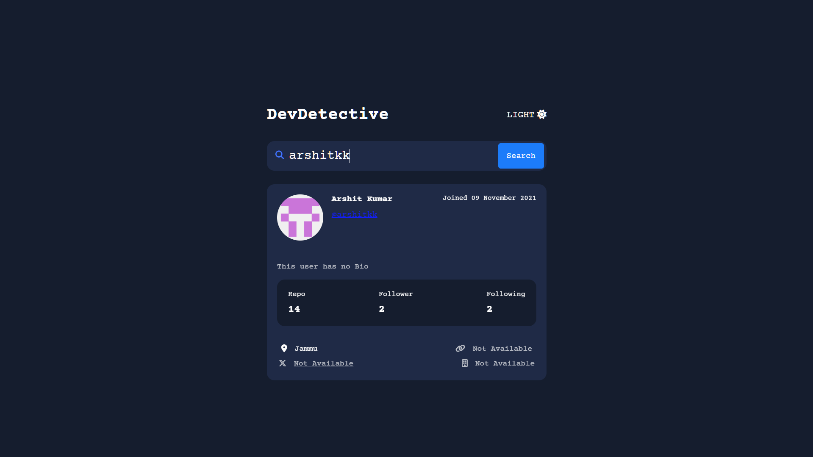
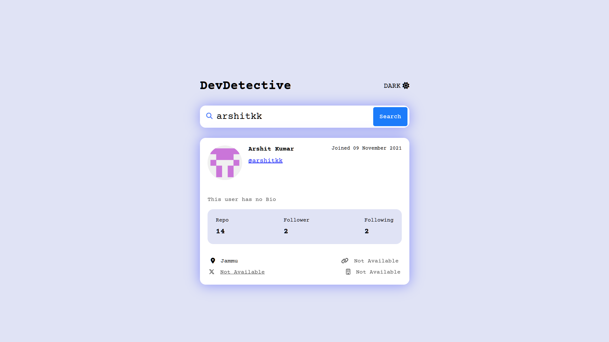

# **Dev Detective** 🕵️‍♂️

**Dev Detective** is a GitHub profile viewer built using JavaScript. It allows users to search for GitHub profiles and view details such as repositories, followers, and more.

---

## **Features**

- Search any GitHub user by username.
- Display user details like profile picture, bio, followers, following, and public repositories.
- Links to repositories and profiles for quick access.
- Dark mode and light mode toggle for better accessibility.
- Secure API integration using a token stored in `env.js` (ignored in `.gitignore`).

---

## **Technologies Used**

- **Frontend**: HTML, CSS, JavaScript
- **API**: GitHub API for fetching user data
- **Security**: Token management through `env.js`

---

## **Dark and Light Mode Previews**

### Light Mode 🌞



### Dark Mode 🌙



---

## **Setup Instructions**

1. Clone the repository:
   ```bash
   git clone https://github.com/arshitkk/dev-detective.git
   ```
2. Create an `env.js` file in the root directory with the following content:
   ```javascript
   const TOKEN = "your_github_api_token_here";
   ```
3. Open `index.html` in a browser to run the application.
